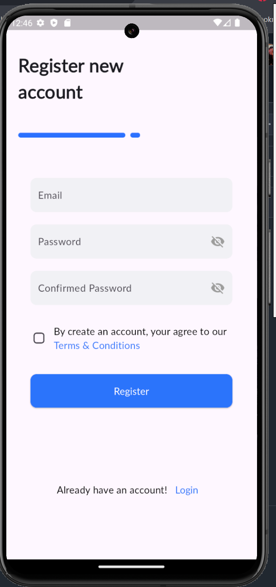
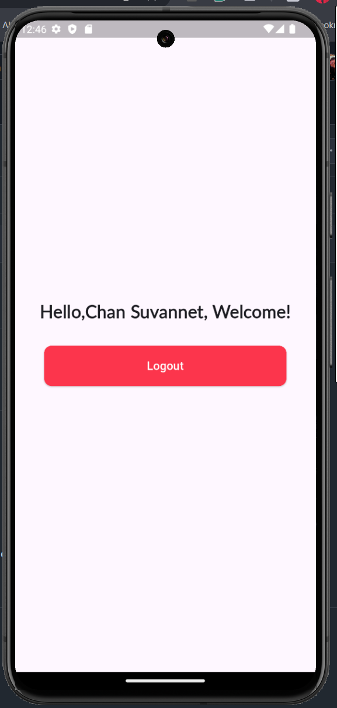

# **Flutter Login UI - Assignment 02**

## **Author**: Chan Suvannet
## **Course**: Introduction to Mobile Application Development
## **Date**: 01-04-2025

---

## **Project Overview**
This Flutter project is a simple yet functional **Login UI** with email/password authentication and a "Login with Google" button. The UI is designed using **Material Design principles**, ensuring a clean and responsive layout.

The app includes:
- Custom **text fields** for user input.
- Custom **buttons** for login actions.
- A "Remember Me" checkbox.
- A **Google login button** with an icon.
- Navigation to a **home screen** upon successful login.

---

## **Features**
✅ Responsive **login page** with a modern UI.  
✅ **Custom reusable widgets** (buttons, text fields) for better code structure.  
✅ **Navigation support** (Redirects to the home screen after login).  
✅ **Material Icons & Assets** integrated from the provided `assets` folder.  
✅ Follows **Flutter best practices** for UI development.  

---

## **Project Structure**
```
├── lib/
│   ├── main.dart                # App entry point
│   ├── screens/
│   │   ├── login_screen.dart    # Login UI Implementation
│   │   ├── home.dart            # Home page after login
|   |   ├── register.dart        # Register page
│   ├── components/
│   │   ├── custom_button.dart   # Reusable button widget
│   │   ├── custom_textfield.dart# Reusable text field widget
│
├── assets/
│   ├── images/
│   │   ├── google.png           # Google login button icon
│
├── pubspec.yaml                 # Project dependencies
├── README.md                    # Project documentation
```

---

## **Screenshots**
### **Login Screen Preview**


### **Home Screen Preview**


### **Home Screen Preview**


---

## **Installation & Setup**
1. **Install dependencies**:
   ```sh
   flutter pub get
   ```
2. **Run the app**:
   ```sh
   flutter run
   ```

Thank you! 🎯🚀

